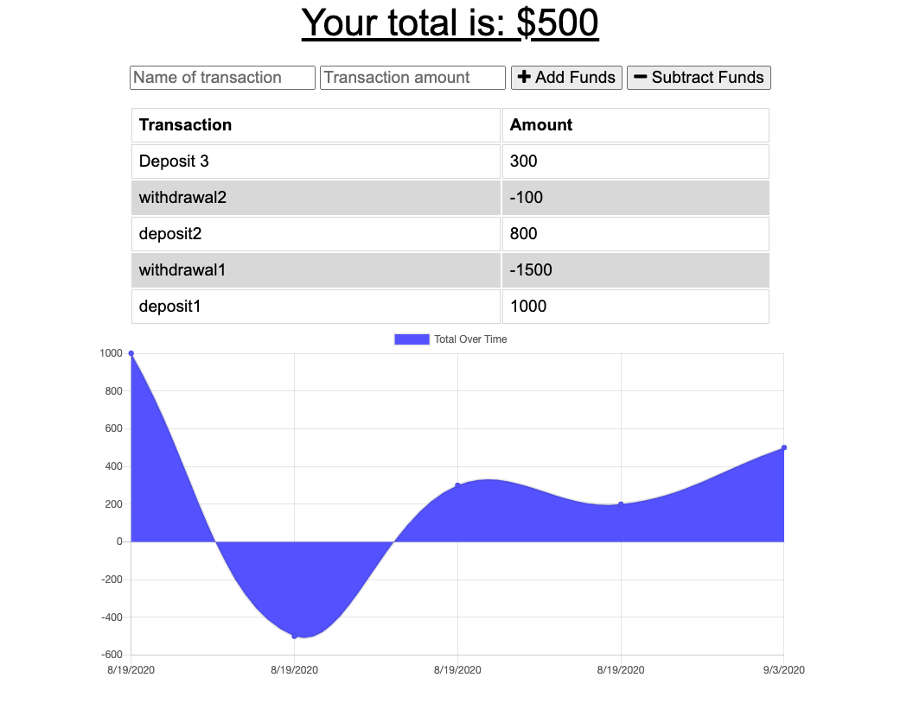

 # Budget-Tracker-indexDB

 ### [Budget-Tracker-indexDB App link !](https://hidden-lake-36299.herokuapp.com/)

 ## Description 
 An app that will keep track of your expenses where ever you go. Enter an expense or deposit and the app will adjust the total accordingly. Also as a PWA(Progressive Web Application) users have an offline experience where their data will not be effected if they go offline.

 **User Story:** <br>
 AS AN avid traveller
 I WANT to be able to track my withdrawals and deposits with or without a data/internet connection
 SO THAT my account balance is accurate when I am traveling

 [](public/assets/img/budget-ScreenShot.png)   

  ## Table of Contents

  * [Installation](#installation)

  * [Usage](#usage)

  * [Build](#build)

  * [Contributing](#contributing)

  * [Questions](#questions)

  ## Installation
  To install required dependencies, run the following command:

  ```npm i```

  ## Usage
  Input description of transaction in input "Name of transaction"</br> 

  Input number amount in "transaction amount"</br> 

  Click button whether the amount needs to deducted or added  </br> 
  
  To use app either follow link below:
  
  https://hidden-lake-36299.herokuapp.com/

  Or run following command on local machine:

  ```node server.js```

  ## Build 
  **Tools Used :** </br> JavaScript JQuery Node.js Mongo Mongoose Morgan Express HTML CSS Heroku PWA Indexdb

  **IndexDB:** </br>
  IndexDB is a client side storage option. In this case created a store that gets all request and check if it's in the database and if not, then adds it to api. 

  **PWA:** </br>
  Manifest</br>
  Created a manifest file, which is built in JSON format and describes the budget app. Manifest properties such as start url and background color, display location and other are specifications to create the UI. 

  Service Worker & Cache </br>
  Service worker is the JS file ran in background to apply event listeners and logic while offline. Caching is implemented in order to fetch api requests while off line. 

  ## Contributing
  Feature to delete transactions in the works.
  
  ## Questions
  If you have a question about this repo, open a issue or contact Laura 915 